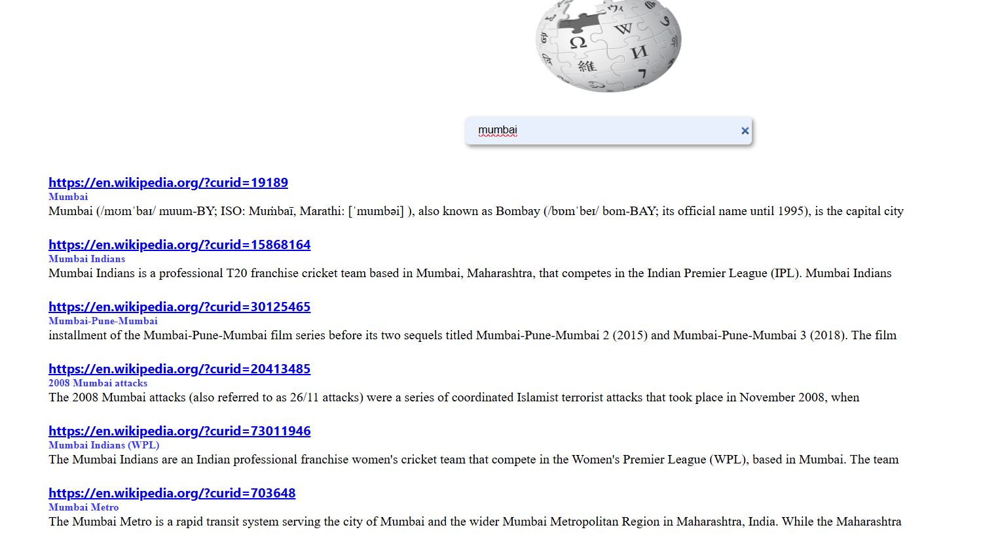

# wikipedia Search Application
🚀 A simple and responsive Wiki Search application built using HTML, CSS, JS that fetches data from the Wikipedia API and displays search results dynamically.
# Live Demo
👉 Click [here](https://vercel.com/new?onboarding=true) to view the live app 

.
